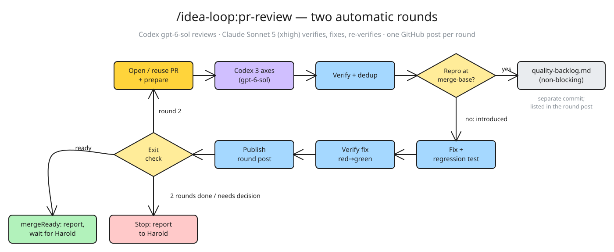

# PR review loop：把 open-review 与 fix-verify 合成一个命令

> 状态：第 2 版，Harold 2026-09-23 已确认，已实现（`skills/pr-review/`、`workflows/pr-review-loop.mjs`、`scripts/github-review.mjs`）。
> 日期：2026-09-23

## 1 为什么改

**慢。** 本机留着 31 次 review workflow 的运行记录（`~/.claude/projects/*/*/workflows/*.json`）。
一次 `pr-fix-verify` 跑 21–78 分钟，常见 50 分钟上下。拆开最近一次干净的运行（50.6 分钟）：

| 阶段 | 耗时 | 在干什么 |
|---|---|---|
| fix:prepare | 4.1m | 读 GitHub 快照、规则、finding |
| **fix:implement** | **10.2m** | 真正改代码 |
| fix:verify | 6.2m | 独立复验修复 |
| review:prepare | 5.2m | **再读一遍**快照和规则 |
| 三轴并行 | 5.1m | |
| review:verify | 7.3m | 验证新 finding |
| **review:publish** | **12.1m** | 重写整份 PR 描述 + Mermaid + 回 thread + 回读 |

改代码只占两成。全部运行里 publish 平均 13.4m、最长 22.2m，是最贵的一步；所有 agent 都跑在
`claude-opus-5[1m]` 上，连只是转发 Codex 原文的那个也是。两个命令之间，每一轮都要人回来手动选 finding、
定方向、再触发一次。

**finding 不一针见血。** #355 / #360 上实际发出的 finding 每条 1000–2300 字，标题写机制不写后果，
「影响」埋在第三段或干脆没有，「实测」是命令输出，不是一个人能照着走的步骤，修法常见「任选其一」。
根因是 `github-review.md` 对 body 只有一句散文要求。按 PR mattpocock/skills#1083 的分类，
这是一条**机械的**规则被写成了散文，于是每次都要 agent 重新理解一遍。

## 2 已拍板的决定

1. **一个 slash 命令** `/idea-loop:pr-review` 取代 `pr-open-review` + `pr-fix-verify`。
2. **自动跑两轮**，然后停下，由 Harold 看两轮的内容再调整。
3. **每轮的流程**：开 PR / 复用 + 准备（合成一个 agent）→ Codex 三轴 review → 问题验证 + 去重 →
   修复 → 回归 + 修复验证 → 发布本轮 → 下一轮。
4. **每轮在 PR 上发一个独立的「轮次帖」**，装下这一轮的全部 finding，以及每条的处理结果：怎么修的、怎么验证的、结果如何。
   下一轮的准备步骤读「PR 描述 + 之前每一轮的轮次帖」，据此做后面的 review。
5. **模型分配**：
   - 三个审核轴全由 Codex 做，模型 `gpt-6-sol`；
   - 验证、去重、修复、回归、修复验证用 **Claude Sonnet 5，effort `xhigh`**，不用 Opus；
   - 发布只做一件事：把本轮内容按上一条的格式发到 PR。
6. **自动修复的范围 = 本次改动引入的、验证为真的问题。** 不是本次引入的，写进目标仓库的
   `docs/quality-backlog.md` §线上问题，在轮次帖里标成不阻塞。
7. **达到 mergeReady 只汇报，合并等 Harold 下令。**
8. **发言身份用 GitHub App `toeflair-claude`**（App ID 4948428，装在 `guohaonan-shy/Tofelair`）。
9. **finding 改成结构化字段**（§6），由 helper 按固定模板渲染。

### 2.1 实现时补充的决定（Harold 2026-09-23 一并确认）

- 开 PR + 准备那个合并后的 agent 也用 Sonnet 5 · `xhigh`（第 2 条模型分配没覆盖到它）。
- 发布 agent 用 Sonnet 5 · `low`：它只执行 helper 命令，不写作。
- Standards 轴拆成两半：项目自己的检查命令（lint / typecheck / test）每轮机械地跑一遍；Codex 只判断写成文字的规则（§3）。
- 自动修不按优先级过滤：本次引入的 P2 也修。
- `impact` ≤ 60 字。
- Spec 轴 finding：`confirmed` 且修法唯一明确时自动修，否则 `needs-decision`（§5 的 (a)）。
- backlog 登记随 PR 分支提交（§5）。
- 轮次帖用每轮一条 Conversation 评论（§4 的 (a)）。

## 3 流程

<!-- 流程图源文件：./pr-review-loop-flow.excalidraw -->


**主会话在调用 Workflow 之前**做两件事：找到 codex companion 的路径；把这场对话里已经接受的任务约定
（ticket / spec 链接、验收标准、范围变更、排除项）整理成参数传进去。workflow 里的 agent 看不到这场对话，
所以第 1 轮会把这份约定写进 PR 描述的「验收契约」一节，第 2 轮从 PR 描述里读回来。

每一轮的步骤：

| 步骤 | 做什么 | 执行者 · 模型 |
|---|---|---|
| ① 开 PR / 复用 + 准备 | 第 1 轮：push、`gh pr create`，PR 描述写入变更说明和验收契约；第 2 轮：复用。然后跑 helper `snapshot`（head/base、merge-base、之前的轮次帖），预检工作树，整理这一轮的**审核契约**：适用规则、验收标准、验证手段对照表、本轮 review 的起点 | Claude · Sonnet 5 · xhigh |
| ② Codex 三轴 | Correctness：`review --model gpt-6-sol --scope branch --base <起点>`；Standards（文字规则）和 Spec：`task --model gpt-6-sol`，只读，提示词带审核契约。三轴并行 | Codex · gpt-6-sol；包装 agent 用 Sonnet 5 · low，设超时 |
| ②′ 项目检查命令 | 跑 REVIEW.md 声明的 lint / typecheck / test（提议，§2.1） | Claude · Sonnet 5 · low |
| ③ 问题验证 + 去重 | 逐条复现，去重，在 merge-base 上重跑以判定是否本次引入（§5），产出结构化 finding（§6） | Claude · Sonnet 5 · xhigh |
| ④ 修复 | 修本次引入的 `confirmed` finding，每条带回归测试；存量问题追加进 backlog（单独 commit）；push | Claude · Sonnet 5 · xhigh |
| ⑤ 回归 + 修复验证 | 独立于修复者：先红后绿、原验证手段重跑、回归范围（§7） | Claude · Sonnet 5 · xhigh |
| ⑥ 发布 | 把本轮 finding + 修法 + 验证结果交给 helper 渲染成轮次帖，发出去 | helper 命令；执行它的 agent 用 Sonnet 5 · low |

**第 2 轮 review 的范围。** 起点 = 第 1 轮修复前的 head：Codex 审第 1 轮修复带来的 diff；
准备步骤从第 1 轮的轮次帖读出哪些 finding 已修、怎么验证的，第 2 轮的问题验证要复核这些结论还成立。

**Codex 的包装 agent 必须设超时。** 历史上有一次 correctness 卡住 941 秒触发重试，一步拖到 27.5 分钟。

## 4 轮次帖

每轮一个帖子，装下这一轮的全部内容。GitHub 原生没有「一个 thread 装多条 finding」的结构，有两种做法：

| | (a) 每轮一条 Conversation 评论（推荐） | (b) 每轮一次 PR review（`event: COMMENT`） |
|---|---|---|
| 形态 | 一条评论，正文是整轮内容，重试时原地编辑 | review 正文是整轮内容，有具体行的 finding 另挂 inline 评论 |
| 代码定位 | 每条 finding 附一个钉在当轮 head SHA 的代码 permalink | inline 评论直接挂在 diff 行上 |
| resolve | 没有；状态写在正文里 | inline 评论可以 resolve，但一轮的内容又被拆散了 |
| 下一轮读取 | 读一条评论即可 | 要读 review 正文和它下面的 inline 评论 |

(a) 最贴近「一轮一个帖子」。代价是没有 GitHub 的 resolve 按钮；如果仓库开了「合并前必须解决所有对话」的分支保护，这道闸会失效。

轮次帖模板：

```markdown
## Review 第 1 轮 · 审 a1b2c3d → 修复后 e4f5a6b

**结论**：发现 4 条（本次引入 3，存量 1）；修复 3 条，验证全部通过；mergeReady：否，Spec 轴 1 条待决定。

| # | 标题 | 优先级 | 轴 | 去向 | 结果 |
|---|---|---|---|---|---|
| F-1 | … | P1 | correctness | 已修 | 验证通过 |
| F-4 | … | P2 | correctness | backlog | 不阻塞 |

### F-1 · [P1] <title>
**影响**：…
**复现**：1. … 2. …
**修法**：<做了什么> · [commit e4f5a6b](…) · [代码](…permalink…)
**验证**：`unit-test` · `<命令>` · 修复前 a1b2c3d 失败 → 修复后 e4f5a6b 通过 · 回归：…
<details><summary>证据</summary> … </details>
```

隐藏 marker 放进这条评论里，helper 的 `snapshot` 据此恢复每一轮的 finding 状态。

## 5 自动修还是进 backlog：判定规则

**「本次引入」的机械判定：在 merge-base 上重跑同一个 reproducer。**

| reproducer 在 merge-base 上 | 在 head 上 | 判定 | 去向 |
|---|---|---|---|
| 不复现（或路径根本不存在） | 复现 | 本次引入（含「本次改动让旧缺陷变得可达」） | 自动修 |
| 复现 | 复现 | 存量问题 | backlog，不阻塞 |
| —（静态 finding） | — | 触发路径上的代码在 diff 里，或调用方被 diff 改了 → 本次引入；否则存量 | 同上 |

上表只适用于 Correctness 轴。另外两个轴：

- **Standards**：检查工具的诊断落在 diff 改动的行上 → 本次引入；落在未改动的行上 → 存量
  （沿用 `review-standards.md`「改了文件不等于引入了诊断」）。文字规则的违反只看 diff 内的代码。
- **Spec**：没有 merge-base 可比，PR 是拿它自己的验收标准判的，未满足的验收项**按定义就是本次的**。
  已定：`confirmed` 且修法唯一明确时自动修，否则 `needs-decision`。

**在 merge-base 上复现的做法。** 沿用 #360 F-1 验证时的做法：`git archive <merge-base> <paths> | tar -x`
解到 scratchpad，用同一个解释器、同一套依赖跑同一个 reproducer。**绝不在被 review 的工作树里
checkout 或 stash**。`api` / `browser` / `db` 类要在 scratchpad 副本上另起服务，端口按 AGENTS.md 的端口耦合规则另选。

在这之前先要过「验证为真」：状态必须是 `confirmed`。以下情况**不自动修**，写进轮次帖，并让 loop 在本轮结束后停下：

- `needs-decision`：修法要做产品取舍（验证那步只列两个选项）；
- `needs-verification`：需要运行时验证，但环境起不来；
- 修复需要改公共接口、DB schema 或迁移。

**backlog 写法。** 追加到 `docs/quality-backlog.md` §线上问题，沿用该节的现有格式：

```
- [ ] **<finding 标题（写后果）>** —— <impact>。复现：<repro 压成一句>。来源：PR #<n> 第 <k> 轮 F-<m>（链接），<日期> review 发现。
```

优先级映射：P0 → 「高」，P1 → 「中」，P2 → 「低」。在 PR 分支上作为一个**单独 commit**
（`docs(backlog): 登记 review 发现的存量问题`）提交，随 PR 合并。文件路径可以在目标仓库的 `REVIEW.md` 里覆盖；
仓库没有这个文件时，退回根目录 `backlog.md`。

## 6 finding 字段

| 字段 | 要求 | helper 校验 |
|---|---|---|
| `title` | 写后果，不写机制 | 非空；不含 `path:line` |
| `impact` | 一句话：谁、在什么情况下、遇到什么后果 | 非空；≤ 60 字；不含 `path:line` |
| `repro` | 编号步骤，从用户动作或输入出发；跨 3 个以上组件时附 Mermaid 时序图 | 数组，≥ 2 步 |
| `fix` | `confirmed` 时只给一个推荐方案 + 一句理由；修完后改写成「做了什么」 | 非空 |
| `options` | 仅 `needs-decision` 时：两个选项及各自代价 | `needs-decision` 时必填、恰好 2 个 |
| `evidence` | 命令输出、行号、追踪过程 | 非空；渲染进折叠的 `<details>` |
| `instrument` | 闭集：`unit-test` / `api` / `db` / `browser` / `eval` / `eval-replay` / `static` | 枚举 |
| `reproducer` | 可直接重跑的命令或浏览器步骤 | `confirmed` 时非空 |
| `introduced` | `true` / `false`，附在 merge-base 上的判定证据 | `false` 时 `blocksMerge` 必须为 false |
| `location` | `{path, line}`，用来生成钉在 head SHA 的 permalink | 可选；有就校验行在 diff 或文件内 |

写不出 `impact` 的 finding 多半不值得阻塞，这个字段顺带逼着优先级诚实。

## 7 验证标准

`instrument` 的取值对应目标仓库 `REVIEW.md` 的「Verification paths」表（Toeflair 已有）。
项目负责「在这里怎么跑」，plugin 只负责标准。

**问题验证（这条 finding 是真的吗）**

- `confirmed` 必须带 `instrument` + `reproducer`，并且验证 agent 亲自跑过；
- `static` 只能用于运行时代价不可接受的情况（花钱、碰生产），正文必须标明是静态推理；
- 只是推测、没有任何追踪的：不发布为 finding，最多作为一个问题；
- 同时在 merge-base 上跑一次，得出 `introduced`（§5）。

**修复验证（真修好了吗）**

- **先红后绿**：`instrument` 是 `unit-test` / `api` / `db` 的，修复 commit 必须带一个回归测试。
  验证 agent 在修复前的 SHA 上跑它、必须失败，在修复后的 SHA 上跑、必须通过。
  `verification` 新增 `beforeSha`、`testRef`；helper 校验 `beforeSha` 是本轮修复前的 head。
- **验证手段不许降级**：`verification.instrument` 必须等于原 finding 的 `instrument`。
  浏览器复现的问题，不能用静态推理关掉。helper 校验。
- **回归范围**：`REVIEW.md` 声明的检查命令，加上修改所涉文件的测试。
- **独立**：修复者和验证者是不同的 agent（同为 Sonnet 5 也要分开）；验证者只看 finding、diff 和修复者的声明，声明不算证据。

## 8 退出条件（全部机械）

| 条件 | 结果 |
|---|---|
| 某一轮的 review 没有本次引入的 `confirmed` finding，且必需检查全部通过 | 提前停：mergeReady，汇报，等 Harold 下令合并 |
| 本轮出现 `needs-decision` / `needs-verification` 阻塞项 | 本轮发布后停，汇报需要 Harold 决定什么 |
| 两轮跑完 | 停，汇报：mergeReady 或还剩什么。第 2 轮修复的正确性只有第 2 轮的修复验证兜底，没有第 3 次 review；汇报里写明 |
| Codex 不可用、发布失败、head 被别人改了 | 停，汇报已完成的部分 |

从不自动 approve，从不自动 merge。

## 9 预期耗时

| | 现在 | 改后（估算） |
|---|---|---|
| 每轮 | review 30–45m + fix-verify 约 50m，中间要人触发 | 约 30–35m：① 5 + ② 6–8 + ③ 6 + ④ 8 + ⑤ 6 + ⑥ 1 |
| 两轮合计 | 2–3 小时 + 人工往返 | 约 60–70m，无需人工触发 |

`api` / `browser` / `db` 类 finding 要在 merge-base 上另起一套环境，③ 约翻倍。Sonnet 5 · xhigh 相对 Opus 的
提速没算进去，实测后再更新这张表。

## 10 发言身份：toeflair-claude App

- 配置放用户目录（plugin 目录只读）：`~/.idea-loop/github-apps.json`
  ```json
  { "guohaonan-shy/Tofelair": { "appId": 4948428, "privateKeyPath": "~/projects/TOFEL-demo/toeflair-claude.pem" } }
  ```
  pem 已确认被 gitignore、未被跟踪。
- `github-review.mjs` 自己用 node `crypto` 签 RS256 JWT → `GET /repos/{o}/{r}/installation` →
  `POST /app/installations/{id}/access_tokens`，拿到的 token 只作为 `GH_TOKEN` 传给同进程的 `gh` 调用。
  **token 不打印、不进 agent 上下文、不落盘。**
- 用 App 身份的：轮次帖。仍用 Harold 身份的：push、创建 PR、写 PR 描述（PR 作者保持是人）。
- 没配置 App 的仓库：退回 `gh` 当前登录身份，轮次帖里注明。
- `github-review.md` 里「已登录账号发布、不冒充其他身份」那句改成：按配置选择身份，用 App 自己的 token 发言不算冒充。
- App 需要的权限：Issues 读写（Conversation 评论）、Pull requests 只读、Contents 只读。选 §4 (b) 的话 Pull requests 要读写。

## 11 要改的文件

| 文件 | 改动 |
|---|---|
| `skills/pr-review/SKILL.md` | 新建，取代下面两个 |
| `skills/pr-open-review/`、`skills/pr-fix-verify/` | 删除 |
| `workflows/pr-review-loop.mjs` | 新建：两轮 loop |
| `workflows/pr-review-round.mjs`、`pr-open-review.mjs`、`pr-fix-verify.mjs` | 删除，逻辑并入上面那个 |
| `references/review-standards.md` | 加 §5 判定规则、§7 验证标准 |
| `references/github-review.md` | 改成轮次帖（§4）、finding 字段（§6）、身份（§10） |
| `references/review-entry.md` | 改：一次调用 = 两轮 loop；模型分配 |
| `scripts/github-review.mjs` | `snapshot` 改读轮次帖；`publish` 改为渲染并发布轮次帖；`validatePlan` 加字段校验；App token |
| `scripts/github-review.test.mjs`、`scripts/review-workflows.test.mjs` | 跟着改 + 新增用例 |
| `skills/implement/SKILL.md` | 指向新命令；写死的 `uv run ruff` 等改为读目标仓库 REVIEW.md |
| `README.md`、`.claude-plugin/plugin.json`、根 `CLAUDE.md`、`.claude-plugin/marketplace.json` | 更新 skill 清单与描述 |

## 12 风险与待验证

- **gpt-6-sol 能不能用。** 本机 codex CLI 是 0.154.0（最新 0.156.1），`~/.codex/config.toml` 默认模型是 `gpt-6-astra`。
  companion 的 `review` 与 `task` 都接受 `--model`（`review` 的 usage 里没写，但参数解析里有）。
  实现前：升级 CLI，用 `--model gpt-6-sol` 各跑一次 `review` 和 `task` 确认。
- **Codex 额度。** 每轮 Codex 调用从 1 次变成 3 次；与 eval 判官共用周订阅额度，
  2026-09-14 撞满过一次（Toeflair `quality-backlog.md` #29）。
- **Codex `task` 只读沙箱能做什么。** 设计里只让它判文字规则、不跑工具；实现前确认它在只读模式下
  能读完整仓库与 diff，且不会因为想跑命令而卡住。
- **subagent 里调 Codex `task` 会不会被 auto mode 拦。** `review` 在 subagent 里稳定跑过 31 次；
  只读的 `task` 预期相同，但实现前先实跑一次。
- **backlog 随 PR 合并。** PR 被关掉不合并时，登记的存量问题会一起丢。
- **旧 PR 的迁移。** 已经用逐条 inline thread 发过 finding 的 PR，`snapshot` 照样读（含 inline 评论），轮次和 F 编号接着旧记录往后排（实测 #355：下一轮是第 4 轮，下一个编号 F-11），不改写旧 thread。
